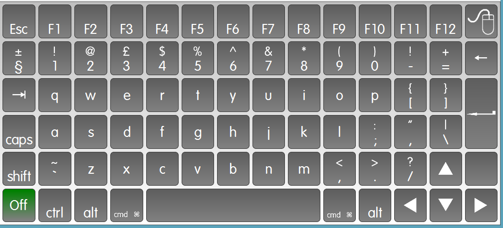

Layouts and Grids
=================

Find here some example MindExpress pages.

##Download##

* The keyboard\_mac.xml file - but note you will miss the images from this page unless you have downloaded it already. It's on here to keep revisioning easier. 
* The [keyboard_mac.jmm] file(https://s3-eu-west-1.amazonaws.com/app-macro/keyboard_mac.jmm). This is the one you will want. 

NB: You will need the font ["VAG Rounded Light"](http://www.fonts101.com/fonts/view/Uncategorized/39723/VAGRoundedLightSSi) for this package to look how it was meant to!

##Running:##

* Make sure you set your mac's IP address by editing the very first page's "On" button.
* Run the server:
    
        python MacroServerMac.py 
    
    or if you want to debug it:

        python MacroServerMac.py --loglevel DEBUG

    And follow the log file that is created in the same directory as the Server. 

##Notes:##

* You will need to keep track of whether the shift/control/command/alt(opt) key has been selected as there is no way of showing this on the MindExpress keyboard.

